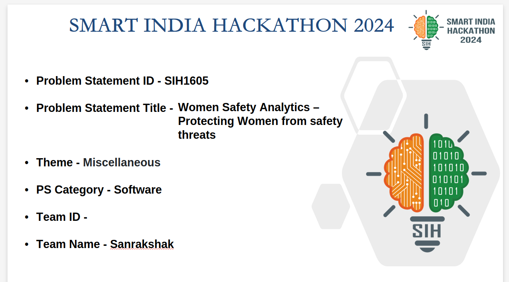

```markdown
# 🚀 SIH 2024 Finalist Project: ML-Driven Detection & Database Management  

## 📌 Overview  

This repository contains our **Smart India Hackathon (SIH) 2024 finalist project**, focusing on **machine learning-based detection systems and database management**. The project includes **Gender Detection, Gesture Recognition, Hotspot Detection, and Face Detection**, integrated with a robust database for efficient data handling.



   

## 🏗️ Tech Stack  

- **Machine Learning**: TensorFlow, OpenCV, Scikit-Learn  
- **Database**: PostgreSQL, MongoDB  
- **Backend**: Python (Flask, FastAPI)  
- **Frontend**: React.js (if applicable)  
- **DevOps**: Docker, Kubernetes  
- **Cloud**: AWS/GCP for model deployment  

## 📂 Project Structure  

```bash
├── Database_Connection/    # Database integration logic  
├── GenderDetection/        # ML model for gender classification  
├── Gesture/               # Gesture recognition module  
├── Hotspot_Detection/     # Identifies activity hotspots  
├── detection_data.csv     # Dataset for ML training  
├── output.csv            # Logs model predictions  
├── organize_files.sh      # Automation script  
├── private/              # Secure data storage  
├── sih/                  # Project documentation  
└── README.md             # Project documentation  
```  

## 🔧 Installation & Setup  

1. Clone the repository:  
   ```bash
   git clone https://github.com/PranjalKumar09/SIH_2024.git
   cd SIH_2024
   ```  
2. Install dependencies:  
   ```bash
   pip install -r requirements.txt
   ```  
3. Set up the database and update configurations in `Database_Connection/`  
4. Run the ML models:  
   ```bash
   python GenderDetection/model.py  
   python Gesture/gesture_recognition.py  
   ```  

## 📊 Features  

✅ **Gender Detection** – Classifies gender using ML models  
✅ **Gesture Recognition** – Identifies user gestures for interaction  
✅ **Hotspot Detection** – Detects activity zones in an area  
✅ **Face Detection** – Recognizes faces for authentication and security  

## 🤝 Contributing  

1. Fork the repository  
2. Create a feature branch: `git checkout -b feature-branch`  
3. Commit changes: `git commit -m "Added new feature"`  
4. Push and open a pull request  

## 📜 License  

This project is licensed under the **Apache License**.  

